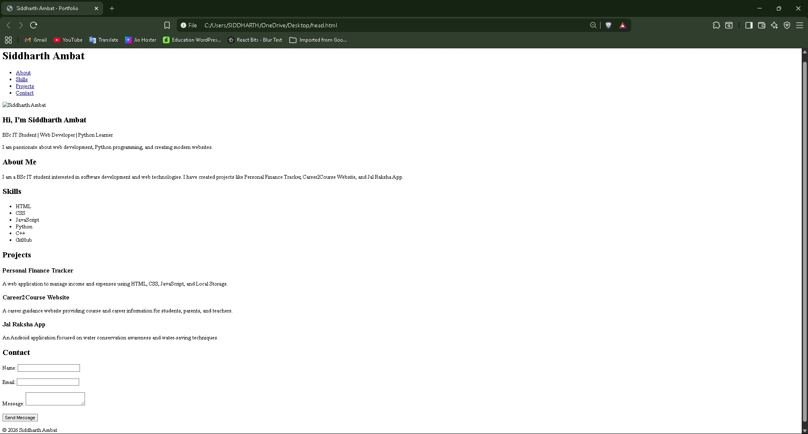

# Personal Portfolio Website

## Project Overview

This project is a personal portfolio website developed using HTML5. The main purpose of this website is to present personal details, skills, projects, and contact information in a clean and organized format.

The portfolio helps in showcasing academic background, technical skills, and project work through different sections on a single webpage.

---

## Objectives

- To create a personal portfolio website using HTML
- To understand the structure of an HTML webpage
- To learn and use semantic HTML tags
- To divide the webpage into different sections
- To create a simple and easy-to-use website

---

## HTML Concepts Used

The following HTML concepts were used while creating this project:

- Basic HTML5 structure
- Semantic HTML tags such as:
  - header
  - nav
  - main
  - section
  - article
  - footer
- Lists using ul and li tags
- Hyperlinks using anchor tags
- Adding images using img tag
- Creating forms using:
  - input
  - textarea
  - button
- Internal navigation using section IDs

---

## Portfolio Structure

The portfolio website contains the following sections:

### Header
Contains the website title and navigation menu.

### Home Section
Displays introduction, profile photo, and short description.

### About Section
Contains personal and educational information.

### Skills Section
Displays technical skills and technologies known.

### Projects Section
Shows details about the projects created.

### Contact Section
Contains a simple contact form for user interaction.

### Footer
Displays copyright information.

---

## Setup and Installation Instructions

1. Download or clone the repository from GitHub.

2. Open the project folder.

3. Open the index.html file in any web browser.

---

## Code Structure Explanation

### index.html
Contains the complete structure and content of the portfolio website.

### images Folder
Stores profile image and screenshot used in the project.

### README.md
Contains complete project documentation.

---

## Technical Requirements Completed

The following requirements were completed successfully:

- Created index.html using proper HTML5 structure
- Added About, Skills, Projects, and Contact sections
- Used semantic HTML tags
- Added navigation links between sections
- Added image and contact form
- Organized project files properly in GitHub repository

---

## Screenshot of Working Application

Add the screenshot of the portfolio website below after running the project.

---

## Technologies Used

- HTML5
- GitHub
